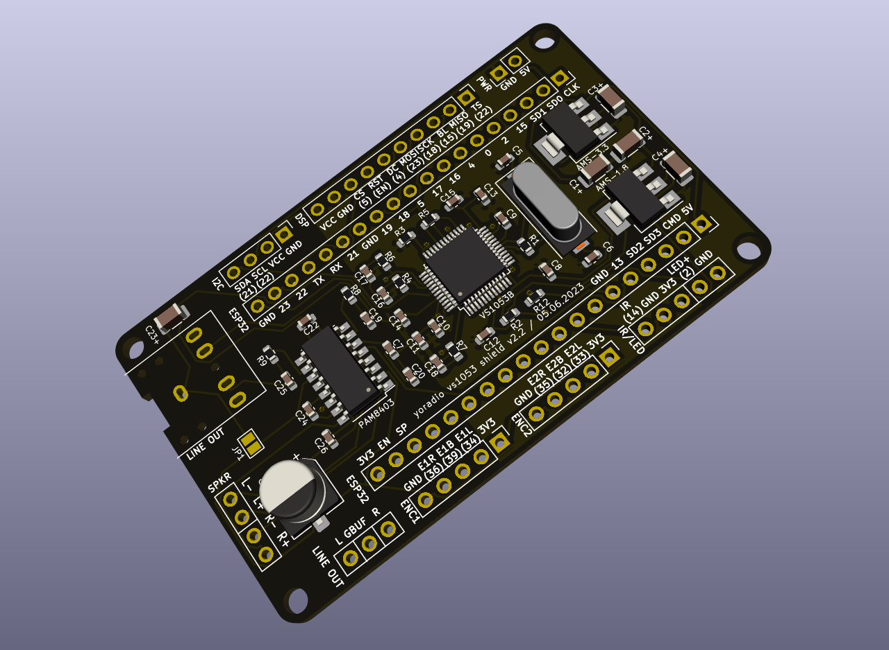

## yoradio VS1053B Shield rev.2


---
- [Gerber files](vs1053shield_v2_GBR.zip)
- [Bill of materials](vs1053shield_v2_BOM_aliexpress.pdf)
- [Schematic](vs1053shield_v2_SCH.pdf)
- [Preview](vs1053shield_v2_02.jpg)

## myoptions.h
#### Base config, without display and controls
```
#define LED_BUILTIN          2
#define I2S_DOUT             255
#define VS1053_CS            27
#define MUTE_PIN             13
#define MUTE_VAL             LOW
```
---
#### Advanced config
```
#define LED_BUILTIN          2
#define DSP_MODEL            DSP_<your_display>
#define I2C_SDA              3
#define I2S_DOUT             255
#define VS1053_CS            27
#define MUTE_PIN             13
#define MUTE_VAL             LOW
/* Uncomment this if you are using an IR receiver */
//#define IR_PIN               14
/* Uncomment this if you are using an Encoder1 */
//#define ENC_BTNL             34
//#define ENC_BTNB             39
//#define ENC_BTNR             36
//#define ENC_INTERNALPULLUP   false
/* Uncomment this if you are using an Encoder2 */
//#define ENC2_BTNL            33
//#define ENC2_BTNB            32
//#define ENC2_BTNR            35
//#define ENC2_INTERNALPULLUP  false
```
## Order
<a href="https://www.pcbway.com/project/shareproject/yoRadio_VS1053B_Shield_rev_2_8f12d5d9.html" target="_blank"></a>
